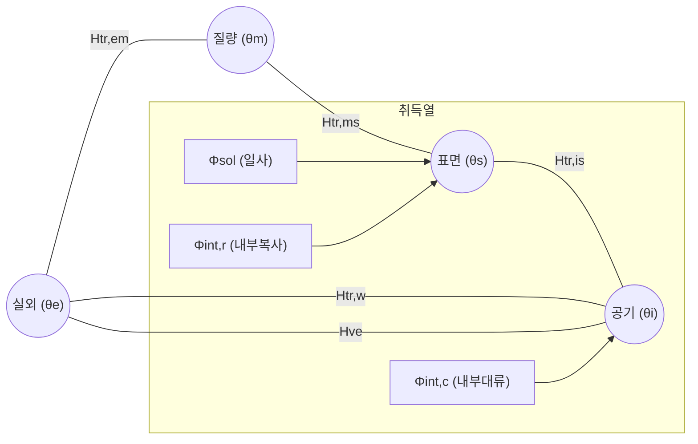

# BeatPlus 에너지 계산 알고리즘 상세 설명서

본 설명서는 BeatPlus 에너지 시뮬레이션 엔진에 구현된 기술적 방법론과 수학적 모델을 설명합니다. 핵심 엔진은 **ISO 52016-1:2017 (Simplified Hourly Method)** 및 **DIN/TS 18599:2018/2024**를 기반으로 합니다.

## 1. 방법론 개요: 5R1C 모델

시뮬레이션은 **5개의 열저항(R)**과 **1개의 열용량(C)**으로 구성된 집중 매개변수 열 네트워크(Lumped-parameter thermal network)를 사용합니다. 이 모델은 건물의 특정 구역(Zone)을 단일 열 노드로 단순화하여 환경 및 내부 발열과의 상호작용을 계산합니다.

### 노드 구조

- **노드 $\theta_i$ (공기 노드)**: 실내 공기 온도를 나타냅니다.
- **노드 $\theta_s$ (표면 노드)**: 내부 표면 온도를 나타냅니다.
- **노드 $\theta_m$ (질량 노드)**: 건물의 열 저장 질량(열용량 $C_m$)을 나타냅니다.
- **노드 $\theta_e$ (외부 노드)**: 실외 공기 온도를 나타냅니다.

---

## 2. 열전달 계수 ($H_{tr}$)

### 2.1 불투명 외피 ($H_{tr,em}$)

벽체, 지붕, 바닥을 통한 열전달을 나타냅니다.

- **Stripping 로직**: 엔진은 사용자가 입력한 $U$-값(내부 열전달저항 $R_{si}$ 포함)에서 내부 표면 저항 성분을 제거하여, 순수 전도 및 외부 저항 성분만을 추출해 계산에 사용합니다.
- **공식**: $H_{tr,em} = 1 / (R_{wall} + $R_{se}$)

### 2.2 창호 ($H_{tr,w}$)

창문과 문을 통한 직접적인 열전달입니다.

- $H_{tr,w} = \sum (A_w \cdot U_w)$

### 2.3 질량-표면 결합 ($H_{tr,ms}$)

- **계수**: $9.1 \, W/m^2K$ (ISO 52016-1 표준값).
- **공식**: $H_{tr,ms} = h_{ms} \cdot A_m$
- **$A_m$ (유효 질량 면적)**: $C_m / 25$로 유도되며, 여기서 25는 구조체의 표준 단위 열용량인 25 Wh/m²K를 의미합니다.

### 2.4 공기-표면 결합 ($H_{tr,is}$)

- **공식**: $H_{tr,is} = h_{ic} \cdot A_{tot}$
- **$h_{ic}$ (대류 계수)**: $3.45 \, W/m^2K$ (ISO 52016-1 표준값).
- **$A_{tot}$ (총 내부 표면적)**: 바닥 면적의 **4.5배**로 추정합니다.

---

## 3. 한국 설계 기준 통합

### 3.1 내부 열전달저항 ($R_{si}$)

엔진은 **건축물의 에너지절약설계기준(별표 5)**에 따른 부위별 $R_{si}$ 값을 적용합니다.

- **벽체**: $0.11 \, m^2K/W$
- **지붕/바닥**: $0.086 \, m^2K/W$

각 구역에 대해 표면 유형별 면적을 고려한 **가중평균 $R_{si}$**를 산출합니다. 이 평균값은 다시 ISO 표준 비율(대류 4 : 복사 6)에 따라 $h_{ic}$와 $h_{rs}$로 분해되어 열 네트워크에 반영됩니다.

### 3.2 동적 열용량 ($C_m$) 계산

고정된 등급 대신 실제 자재 레이어 정보를 기반으로 열용량을 계산합니다.

- $\kappa = \sum (d \cdot \rho \cdot c)$ (두께 $\times$ 밀도 $\times$ 비열).
- 계산은 **실내 측에서 외부 측 방향**으로 진행되며, 단열재 레이어($\lambda < 0.06 \, W/mK$)를 만나면 열적 질량 축적이 중단되는 구조로 설계되어 실제 유효 열용량을 정확히 포착합니다.

---

## 4. 시간별 솔버(Solver) 로직

매 시간(8760시간)마다 엔진은 다음 3단계 계산을 수행합니다.

### Step A: 자연 실온 상태 (Free-Floating)

냉난방 기기가 꺼져 있다고 가정($Q = 0$)할 때의 실내 온도($T_{i,free}$)를 계산합니다.

### Step B: 공조 상태 (Conditioned)

- $T_{i,free} < \text{난방 설정온도}$인 경우: 설정온도를 유지하기 위해 필요한 난방 에너지를 산출합니다.
- $T_{i,free} > \text{냉방 설정온도}$인 경우: 설정온도를 유지하기 위해 필요한 냉방 에너지를 산출합니다.
- $Q_{HC}$는 $T_{i,free}$와 목표 설정온도 사이의 차이를 메우기 위해 필요한 에너지입니다.

### Step C: 질량 온도 업데이트

질량 노드($\theta_m$)에 저장된 에너지를 Explicit Euler 방법을 통해 다음 시간대로 갱신합니다.
$\theta_{m,next} = \theta_{m,prev} + \frac{\Phi_m + \Phi_{st} + \Phi_{ia}}{C_m}$

---

## 5. 기상 데이터 활용

엔진은 EPW 파일에서 추출한 **TMYx(Typical Meteorological Year, 2009-2023)** 데이터를 사용합니다.

- 건구 온도, 직달/산란 일사량, 풍속, 습도 데이터가 포함됩니다.
- 경사면 및 방위별 시간당 일사량은 Reindl 모델을 통해 정밀하게 계산됩니다.
